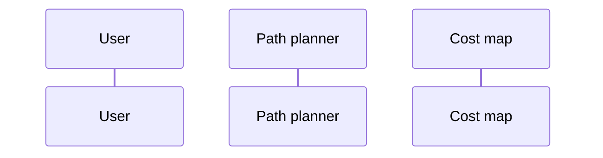

Path planner API trade study for CodeJam22
## Domain definition
* For **UGV** (not UxV)
  * Vehicles with different dimensions
    * May have different wheelbases and clearance
  * May or may not have independent control over rotation (differential vs Ackermann)
  * Has no direct control over elevation
    * Changes in 2D position affect elevation
  * Controllable payloads (turrets, masts, ISR, etc.) and platform capabilities (generator, lights etc.)
* Path planner will be **invoked by the vehicle in real-time**
  * At multiple resolution levels/scales (soft real-time)
    * Hierarchical iterative process
  * Some of the small scale invocations will have hard real-time constraints (obstacle avoidance)
* Path planner will be **invoked by a mission solver**
  * On C2, simulation or on the vehicle
  * Probably invoked 1000+ times per solver run
* Path planner will be given an ordered set of goals
  * The path planner **does not change the number or order of goals**

### [[use-cases]]

## Structure and context
#### Dependencies

#### Usage

## Tests
* [[tests.unit]]
* [[tests.scenarios]]
* [[tests.proposals]]

## API studies
* [[api.planner]]
  * [📝Proposed planner API](assets/proposals.planner.hpp)
* [[api.cost]]
  * [📝Proposed cost API](assets/proposals.cost.hpp)
  * [[api.cost.access]]
    * [📝Proposed cost access API](assets/proposals.cost.access.hpp)
* [[api.search-space]]
  * [📝 Proposed search space API](assets/proposals.search.space.hpp)
  * [[api.search-space.state]]
  * [[api.search-space.target]]
  * [[api.search-space.path]]
* [[api.vehicle]]
  * [📝Proposed vehicle API](assets/proposals.vehicle.hpp)
* [[api.diagnostics]]

