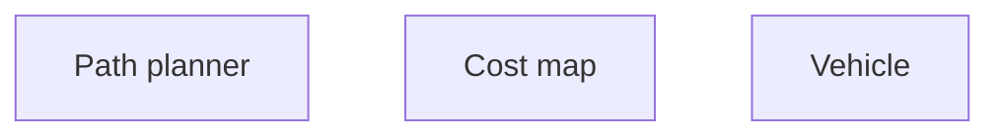
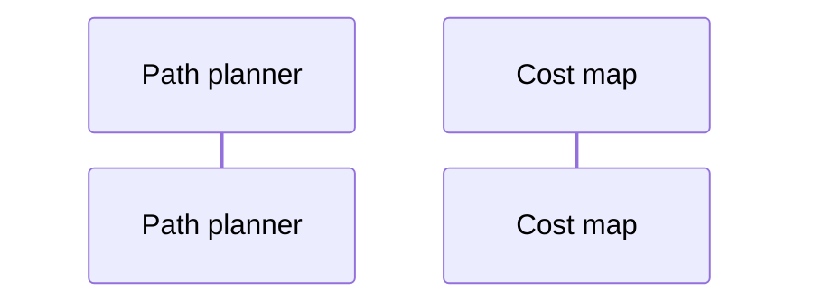

Path planner API trade study for CodeJam22

## Structure and context
#### Dependencies

#### Usage

## API studies
* [[api.planner]]
  * [📝Proposed planner API](assets/proposals.planner.hpp)
* [[api.cost]]
  * [📝Proposed cost API](assets/proposals.cost.hpp)
  * [[api.cost.access]]
    * [📝Proposed cost access API](assets/proposals.cost.access.hpp)
* [[api.search-space]]
  * [📝 Proposed search space API](assets/proposals.search.space.hpp)
  * [[api.search-space.state]]
  * [[api.search-space.target]]
  * [[api.search-space.path]]
* [[api.vehicle]]
  * [📝Proposed vehicle API](assets/proposals.vehicle.hpp)
* [[api.diagnostics]]

